# AWS URL Shortener

A serverless URL shortener built with AWS Lambda, API Gateway, and S3. This project allows users to shorten long URLs and access them via a custom short link.

## Architecture

1. **Frontend**: Static HTML/JS hosted on S3
2. **API**: HTTP API Gateway connected to Lambda
3. **Storage**: S3 bucket for storing URL mappings
4. **Redirects**: S3 static website hosting for URL redirection

## Prerequisites

- AWS account with appropriate permissions
- Basic knowledge of AWS services (S3, Lambda, API Gateway)
- Text editor for code modifications

## Setup Instructions

### 1. Create S3 Buckets
You will need two S3 buckets
#### Bucket A - URL Storage (The Database)
1. Go to S3 → Create bucket
2. Bucket name: url-shortener-data-12345 (must be globally unique, add random numbers)
3. Region: Choose closest to you (e.g., us-east-1)
4. Block Public Access settings:
* UNCHECK "Block all public access" (we need public access for redirects)
* Check the acknowledgment box
5. Click Create bucket
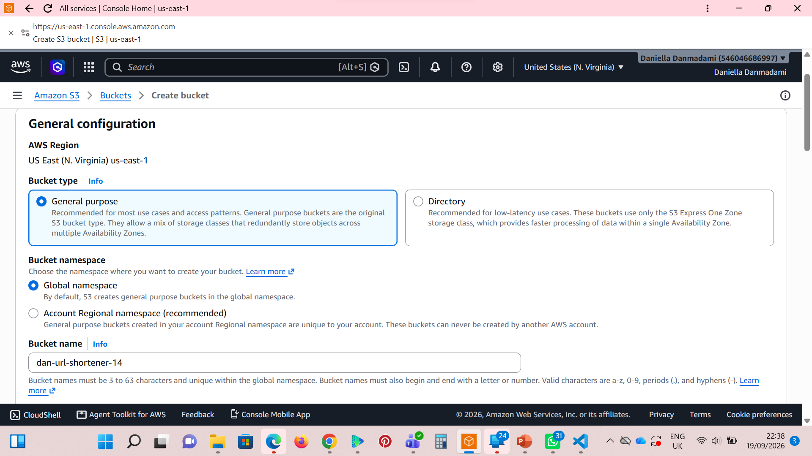

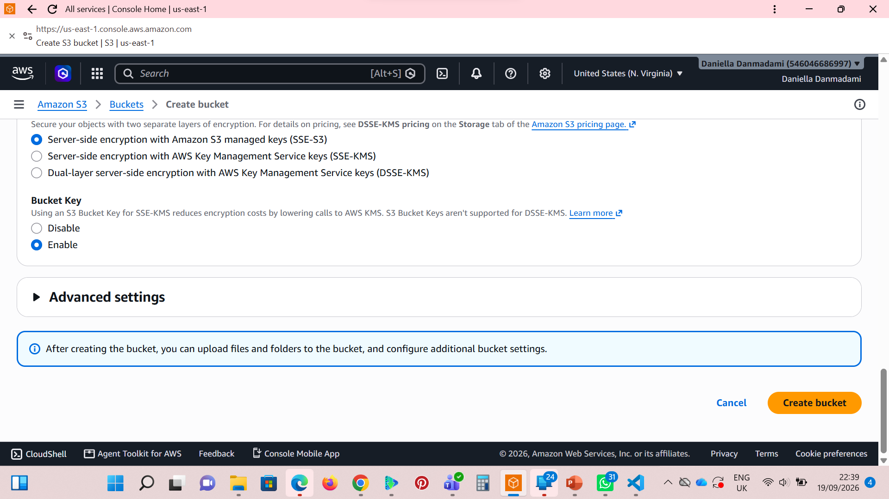
#### Bucket B - The Frontend
1. Create another bucket: url-shortener-frontend-12345
1. Uncheck "Block all public access" again
### 2. Configure Static Website Hosting

1. Go to S3 console
2. Select your bucket
3. Go to Properties → Static website hosting
4. Enable and set:
   - Index document: `index.html`
   - Error document: `error.html`
5. Do this for both buckets
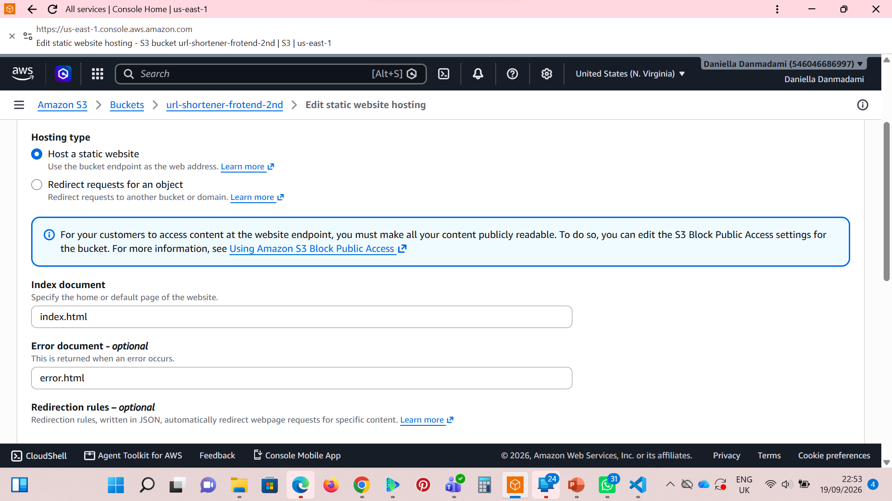
### 3. Deploy Lambda Function

1. Go to Lambda → Create function
2. Function name: url-shortener-backend
3. Runtime: Python 3.14
4. Architecture: x86_64
5. Click Create function
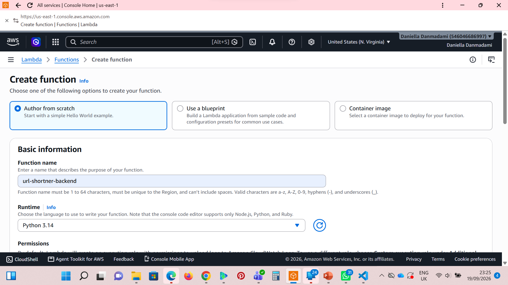
#### Configure Environment Variables
In the function page:

1. Configuration tab → Environment variables → Edit
2. Add two variables:

- BUCKET_NAME = url-shortener-data-12345 (your first bucket name)
- BASE_URL = http://url-shortener-data-12345.s3-website-us-east-1.amazonaws.com (the URL from Step 1)
3. Save
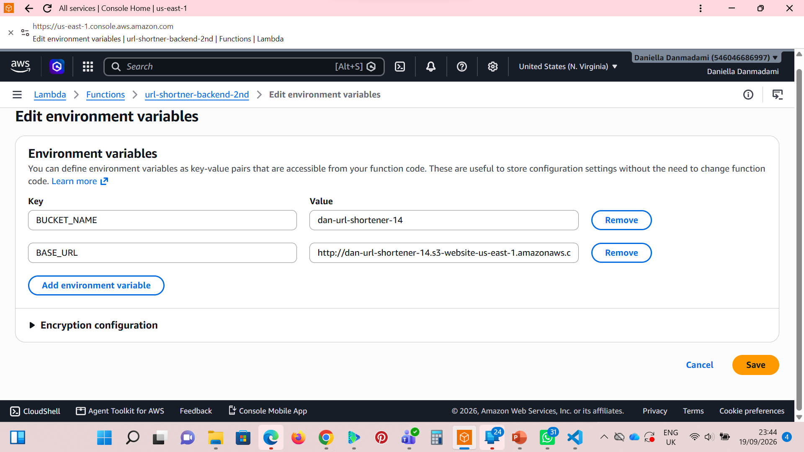
#### Add the code
1. Replace the code with the contents of lambda_function.py in this repository
2. Click Deploy after adding the code
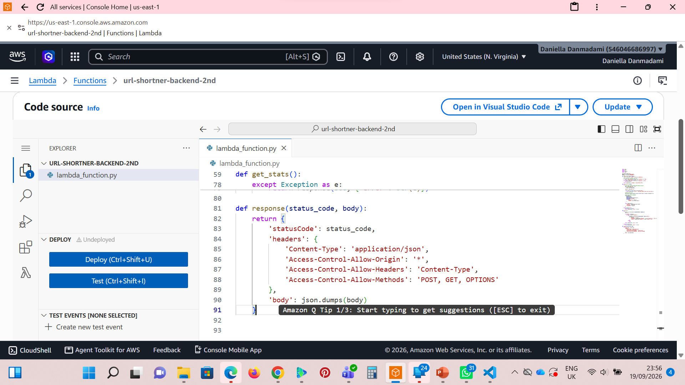

#### Add necessary permissions
You need to give the default lambda execution role permissions to your S3 buckets
1. On the url-function-backend on Lambda, click configuration, then click permissions
2. On this page, you will see the lambda executor role, click on it and it will take you to IAM
3. On the IAM page, click on add permissions, then select attach policies. 
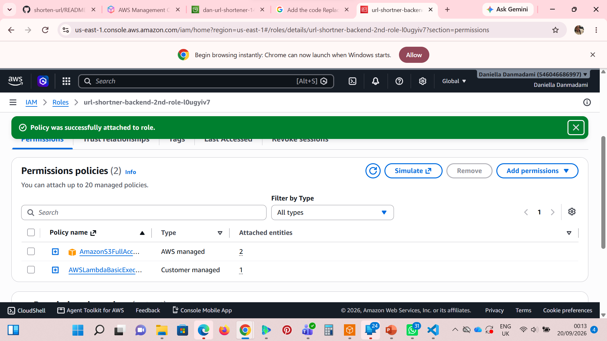
4. Search for the AmazonS3FullAccess permission and attach it to your Lambda role. 
### 4. Create API Gateway
Use HTTP API (cheaper, simpler CORS).

1. Go to API Gateway → Create API
2. Click Build under "HTTP API" (not REST API)
3. Add integration:
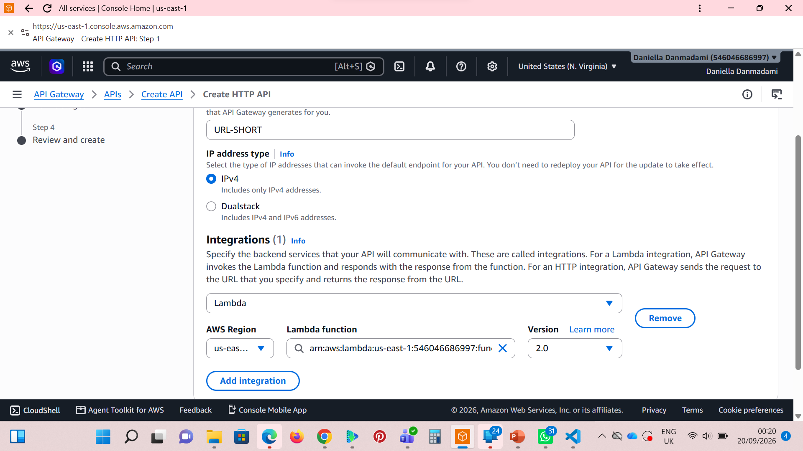
#### Integration type: Lambda
Lambda function: Select url-shortener-backend
Version: 2.0 (latest)
Click Create

Create Routes
Click Next to Routes, then Create these:
Route 1: Create URL

* Method: POST
* Resource path: /shorten
* Integration target: Select your Lambda
* Create
#### Route 2: Get Stats
* Method: GET
* Resource path: /stats
* Integration target: Select your Lambda
* Create
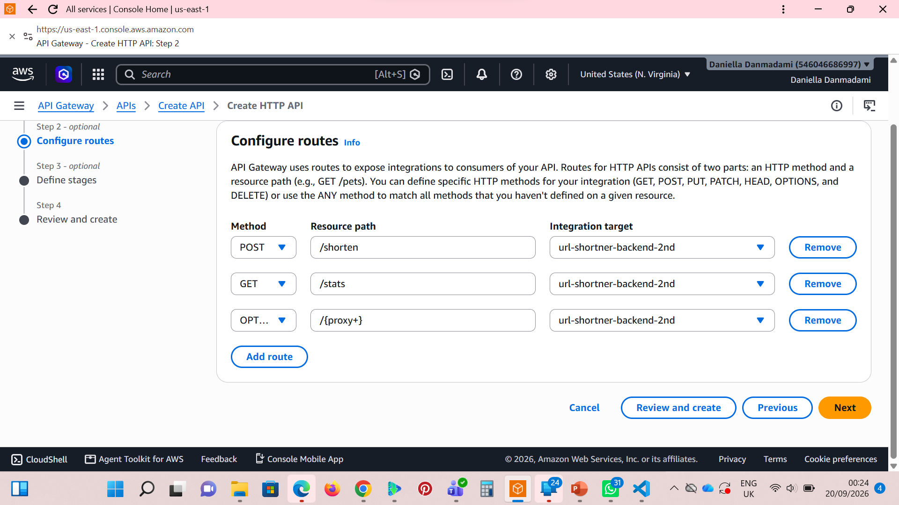
## Route 3: CORS Preflight (Important!)
* Method: OPTIONS
* Resource path: /{proxy+} (this catches all paths)
* Integration target: Select your Lambda
* Create
#### Configure CORS
Click Next until you see Configure CORS:
* Access-Control-Allow-Origin: *
* Access-Control-Allow-Methods: GET, POST, OPTIONS
* Access-Control-Allow-Headers: Content-Type
* Click Next → Create
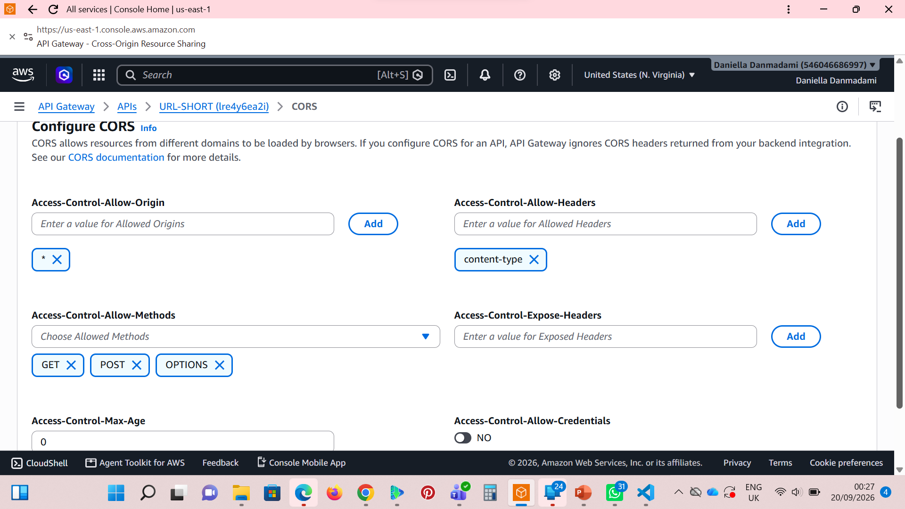
#### Get your API Endpoint
Once created, you'll see an Invoke URL at the top (looks like: https://abcdef123.execute-api.us-east-1.amazonaws.com)
Copy this URL - you need it for the frontend.

### 5. Deploy Frontend to S3

1. Go to S3 → Your frontend bucket (url-shortener-frontend-12345)
2. Upload → Add files → Select your index.html
3. Click Upload

Make it Public

1. Go to Permissions tab of the bucket
2. Bucket Policy → Edit
3. Paste this policy (replace your-bucket-name):
```
{
    "Version": "2012-10-17",
    "Statement": [
        {
            "Sid": "PublicReadGetObject",
            "Effect": "Allow",
            "Principal": "*",
            "Action": "s3:GetObject",
            "Resource": "arn:aws:s3:::url-shortener-frontend-12345/*"
        }
    ]
}
```
4. Save changes
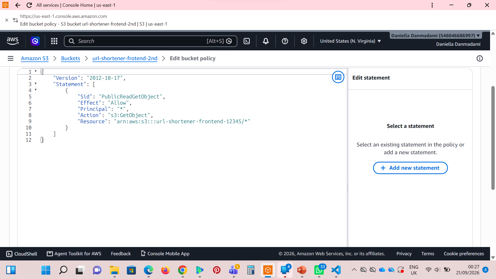
#### Set Content-Type (Important)
1. Go back to Objects tab
2. Click on index.html
3. Properties tab → Metadata
4. Ensure Content-Type is text/html (not binary/octet-stream)
5. If not, click Edit, set Key: Content-Type, Value: text/html

### 6. Fix S3 Redirect Bucket Policy
Your URL storage bucket also needs to be readable for the redirects to work:

1. Go to S3 → url-shortener-data-12345 → Permissions
2. Bucket Policy → Edit
3. Paste:
```
{
    "Version": "2012-10-17",
    "Statement": [
        {
            "Sid": "AllowPublicRead",
            "Effect": "Allow",
            "Principal": "*",
            "Action": "s3:GetObject",
            "Resource": "arn:aws:s3:::url-shortener-data-12345/*"
        }
    ]
}
```
## Usage

### Shorten a URL

```bash
curl -X POST \
  https://your-api-id.execute-api.us-east-1.amazonaws.com/shorten \
  -H "Content-Type: application/json" \
  -d '{"url":"https://www.example.com"}'
```

Response:
```json
{
  "shortUrl": "http://bucket.s3-website-us-east-1.amazonaws.com/abc123",
  "shortCode": "abc123",
  "originalUrl": "https://www.example.com"
}
```

### Access Short URL

Visit the returned `shortUrl` in your browser to be redirected to the original URL.

## Frontend Interface

1. Open your S3 static website URL in a browser
2. Enter a long URL in the input field
3. Click "Shorten"
4. Copy the generated short URL

Here is a photo of how the frontend is
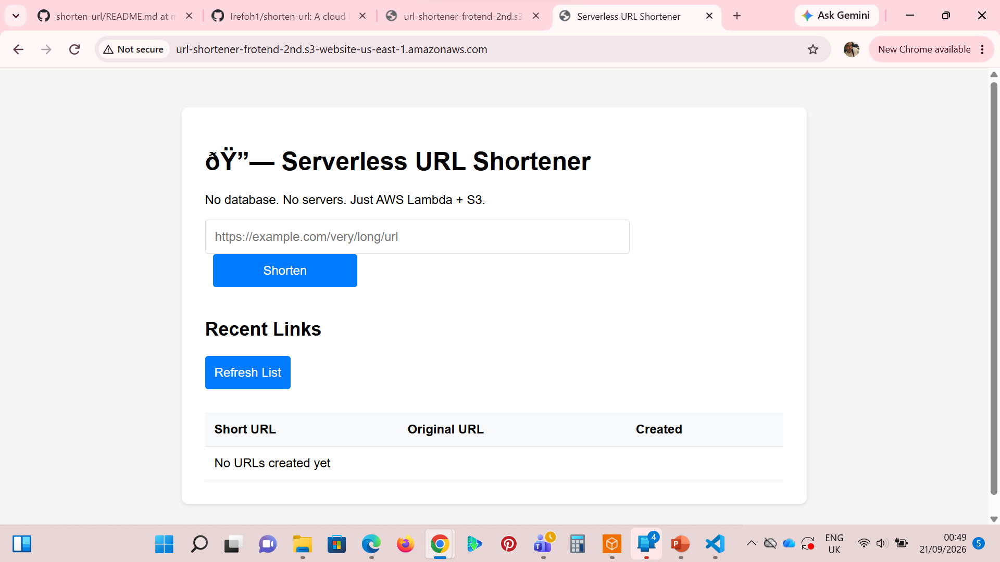

## Custom Domain Setup (Optional)

For shorter URLs like `https://go.yourdomain.com/abc123`:

1. Purchase a domain through Route 53 or another registrar
2. Create a CloudFront distribution pointing to your S3 bucket
3. Set up DNS records to point to CloudFront

## Troubleshooting

### Common Issues

1. **Failed to fetch**: Check CORS configuration in API Gateway
2. **Redirect not working**: Verify S3 static website hosting is enabled
3. **Empty bucket**: Check Lambda execution role permissions
4. **Access Denied when clicking short link?** :
* Check Bucket Policy on url-shortener-data-12345 (Step 7)
* Ensure "Block Public Access" is disabled on the bucket

### Debugging Steps

1. Check CloudWatch logs for Lambda errors
2. Verify API Gateway CORS settings
3. Inspect S3 object metadata for redirect configuration

## Cleanup

To avoid ongoing charges:

```bash
# Delete the S3 bucket and all contents
aws s3 rb s3://your-bucket-name --force

# Delete the Lambda function
aws lambda delete-function --function-name url-shortener-backend

# Delete the API Gateway
aws apigateway delete-api --api-id your-api-id
```

## License

This project is open source and available under the MIT License.